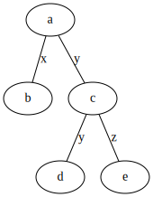
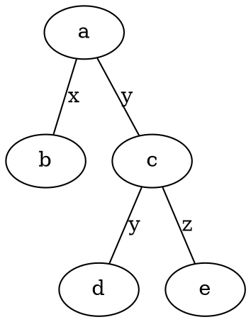
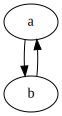
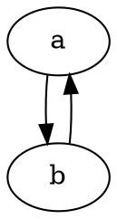

# Graphs
This is an example that I've actually used in my lecture notes.
Let's say I want to include a diagram, drawn programmatically.
First, I include the image:

Then I can add the code, folded away in a `details` tag.

Graphviz code

<!-- :Tangle(dot) first-diagram.dot -->

Then a second diagram, in the same way.

Graphviz code

<!-- :Tangle(dot) second-diagram.dot -->

Now in the markdown document, I just call `:Tangle` in Vim.
I close the markdown document window, and run `:windo make`.
My ftplugin for Dot files sets makeprg to `dot -Tsvg -O %`, which means the graphs will be simple to generate, and will be made with easily predictable filenames.
